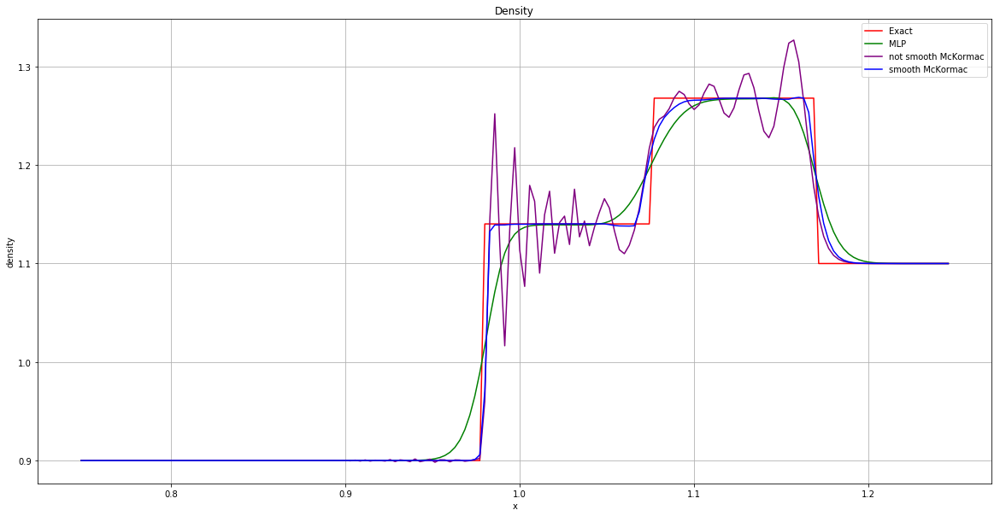
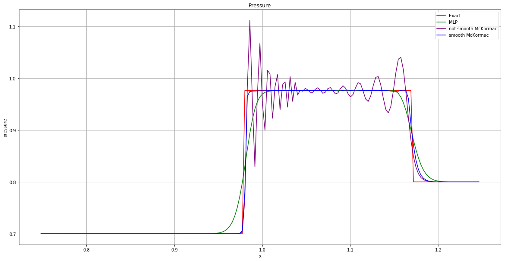
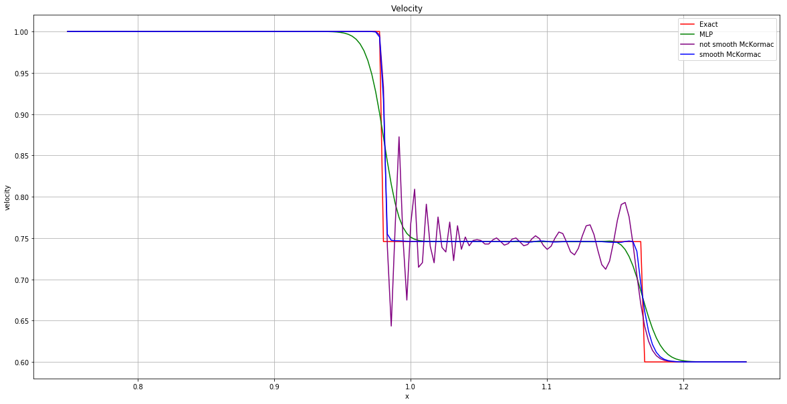

# Shockwave evolution modelling

Method of Large Particles and McKormac were considered.

<figure>
  <figtitle>Density</figtitle>
  
</figure>

<figure>
  <figtitle>Pressure</figtitle>
  
</figure>

<figure>
  <figtitle>Velocity</figtitle>
  
</figure>
